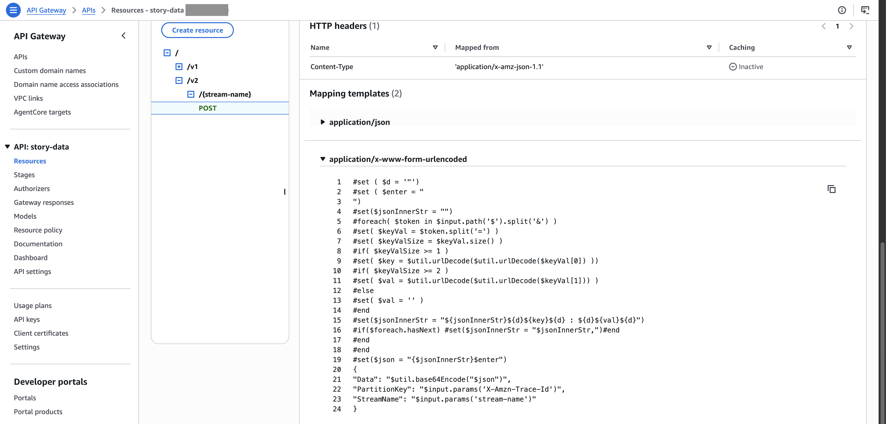
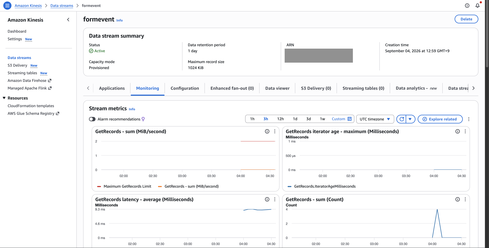
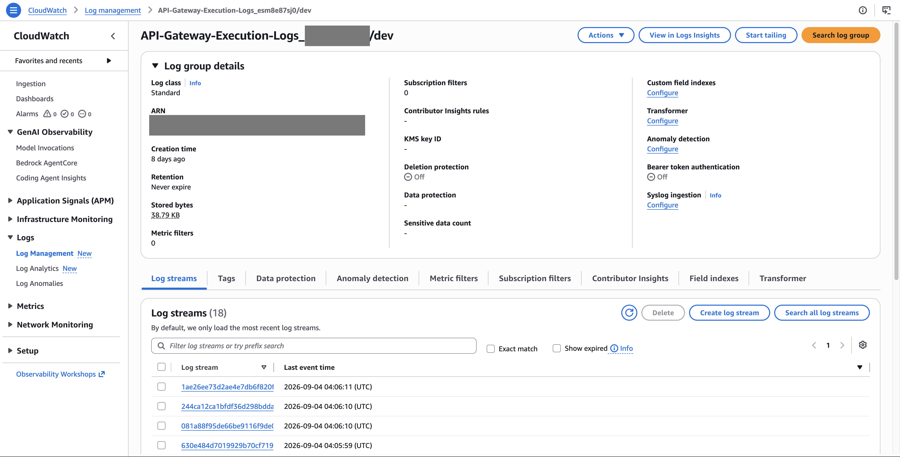
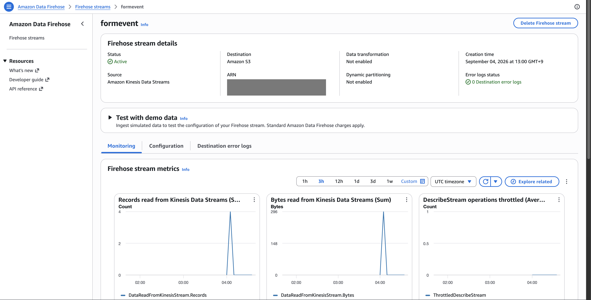
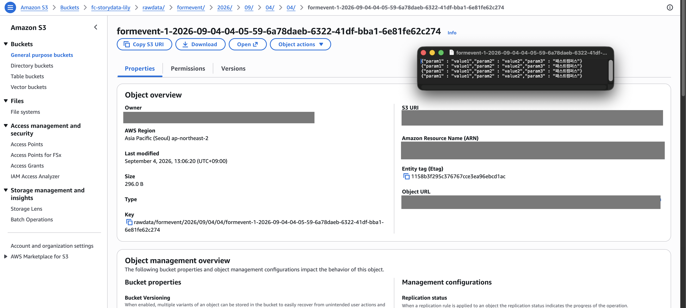
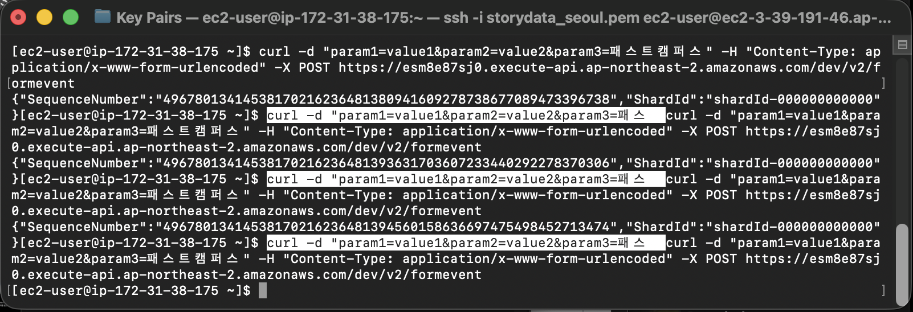

# SaaS Log Ingestion Pipeline on AWS

A serverless SaaS event log ingestion pipeline built with Amazon API Gateway, Amazon Kinesis Data Streams, and Amazon S3.

This project simulates an external SaaS service sending application event logs to an AWS-based data ingestion pipeline through HTTP POST requests.

---

## Overview

Modern applications and SaaS platforms continuously generate large volumes of event and application logs.

This project demonstrates how external event data can be collected through an HTTP endpoint and streamed into AWS for scalable storage.

The pipeline receives `application/x-www-form-urlencoded` requests through Amazon API Gateway, converts the incoming request data into a format suitable for downstream processing, and sends the data to Amazon Kinesis Data Streams.

The collected data is then delivered to Amazon S3 for persistent storage.

### Project Objectives

- Receive external event logs through an HTTP API
- Handle `application/x-www-form-urlencoded` request data
- Transform incoming request data through API Gateway
- Stream event data using Amazon Kinesis Data Streams
- Store collected logs in Amazon S3
- Validate the end-to-end ingestion pipeline using `curl`
- Monitor and verify successful data ingestion

---

## Architecture

```text
External Client / Streamlit
          |
          | HTTPS POST
          v
+-------------------------+
|     Amazon API Gateway  |
|                         |
|  Request Transformation |
+------------+------------+
             |
             v
+-------------------------+
| Amazon Kinesis Data     |
| Streams                 |
+------------+------------+
             |
             v
+-------------------------+
| Amazon Kinesis Data     |
| Firehose                |
+------------+------------+
             |
             v
+-------------------------+
|       Amazon S3         |
|     formevent bucket    |
+-------------------------+

             |
             v
+-------------------------+
|    Amazon CloudWatch    |
|       Monitoring        |
+-------------------------+
```

## Architecture Components

| Component | Role |
|---|---|
| **External Client** | Simulates an external application or SaaS service generating event logs |
| **Amazon API Gateway** | Receives HTTP POST requests from the external client |
| **API Gateway Mapping Template** | Transforms the incoming request data before sending it to Kinesis |
| **Amazon Kinesis Data Streams** | Provides the real-time streaming layer for incoming event data |
| **Amazon Kinesis Data Firehose** | Delivers streaming data to Amazon S3 |
| **Amazon S3** | Provides persistent storage for the collected event logs |
| **Amazon CloudWatch** | Used to monitor and verify API activity |

---

## Data Flow

The event data flows through the following pipeline:

    External Client
          |
          | HTTPS POST
          v
    API Gateway
          |
          | Request Transformation
          v
    Kinesis Data Streams
          |
          v
    Kinesis Data Firehose
          |
          v
    Amazon S3

The architecture separates the HTTP ingestion layer, real-time streaming layer, and persistent storage layer.

---

## HTTP Request

The API endpoint was tested from an Amazon EC2 instance using an HTTP `POST` request.

The request used the following content type:

    Content-Type: application/x-www-form-urlencoded

Example request:

    curl -d "param1=value1&param2=value2&param3=패스트캠퍼스" \
    -H "Content-Type: application/x-www-form-urlencoded" \
    -X POST \
    https://<api-gateway-endpoint>/dev/v2/formevent

The actual API Gateway endpoint is not included in this repository for security reasons.

### Request Body

The request body contains URL-encoded key-value pairs:

    param1=value1
    param2=value2
    param3=패스트캠퍼스

This demonstrates how an external application can send form-encoded event data to an HTTP endpoint.

---

## API Gateway

Amazon API Gateway was configured as the HTTP entry point for the event ingestion pipeline.

The API accepts HTTP `POST` requests and forwards the incoming event data to Amazon Kinesis Data Streams.

The request uses:

    application/x-www-form-urlencoded

as the `Content-Type`.

---

## Request Transformation

The incoming request data was transformed using an API Gateway Mapping Template before being forwarded to Amazon Kinesis Data Streams.

The overall process is:

    application/x-www-form-urlencoded
                  |
                  v
           Amazon API Gateway
                  |
                  | Mapping Template
                  v
           Kinesis-compatible data

This transformation allows the external request format to be converted into a structure suitable for downstream processing.

---

## Kinesis Data Streams

Amazon Kinesis Data Streams was used as the real-time streaming layer.

After a successful HTTP request, the API returned a response containing a `SequenceNumber` and `ShardId`.

Example response:

    {
      "SequenceNumber": "49678013414538170216236481380941609278738677089473396738",
      "ShardId": "shardId-000000000000"
    }

The returned `SequenceNumber` and `ShardId` confirmed that the event record was successfully accepted by the Kinesis stream.

---

## Kinesis Data Firehose

Amazon Kinesis Data Firehose was configured to deliver the streaming data to Amazon S3.

    Kinesis Data Streams
            |
            v
    Kinesis Data Firehose
            |
            v
    Amazon S3

Firehose provides a managed delivery layer between the streaming data source and the S3 storage destination.

---

## Amazon S3

Amazon S3 was used as the persistent storage destination for the collected event logs.

The collected data was delivered to the ```formevent``` S3 bucket.

After executing the test request four times, four data objects were successfully observed in the bucket.

This confirmed that the event data was successfully delivered through the ingestion pipeline and persisted in S3.

---

## CloudWatch Monitoring

Amazon CloudWatch was used to monitor and verify API activity during testing.

Four corresponding events were observed in CloudWatch after executing the HTTP requests.

CloudWatch provided an additional validation point for the ingestion pipeline.

---

## Testing

The pipeline was tested from an Amazon EC2 instance using `curl`.

### Test Command

    curl -d "param1=value1&param2=value2&param3=패스트캠퍼스" \
    -H "Content-Type: application/x-www-form-urlencoded" \
    -X POST \
    https://<api-gateway-endpoint>/dev/v2/formevent

The request was executed four times.

Each successful request returned a Kinesis response containing:

    SequenceNumber
    ShardId

Example:

    {
      "SequenceNumber": "...",
      "ShardId": "shardId-000000000000"
    }

---

## Test Results

The end-to-end ingestion pipeline was successfully validated.

| Test Point | Result |
|---|---|
| HTTP POST request | ✅ Successful |
| API Gateway | ✅ Request received |
| Request transformation | ✅ Successfully processed |
| Kinesis Data Streams | ✅ Data accepted |
| CloudWatch | ✅ 4 events observed |
| Kinesis Data Firehose | ✅ Data delivered |
| Amazon S3 | ✅ 4 objects stored |

### End-to-End Validation

    EC2 / curl
        |
        v
    API Gateway       ✓
        |
        v
    Kinesis Streams   ✓
        |
        v
    Kinesis Firehose  ✓
        |
        v
    S3                ✓

    CloudWatch        ✓
    4 events observed

---

## Troubleshooting

During the initial test, the request failed because an incorrect API Gateway endpoint was used.

    curl: (6) Could not resolve host

After correcting the API Gateway endpoint, the request was successfully processed.

The API returned a valid `SequenceNumber` and `ShardId`, confirming that the data was accepted by the Kinesis stream.

This troubleshooting process demonstrated the importance of validating API endpoints and checking service responses when debugging a cloud-based data ingestion pipeline.

---

## Key Learnings

### 1. HTTP Content-Type

I learned how the `Content-Type` HTTP header specifies the format of the request body.

This project used:

    application/x-www-form-urlencoded

The request body was structured as:

    key=value&key=value

This format was received by API Gateway and transformed before being forwarded to Kinesis.

---

### 2. API Gateway as an Ingestion Layer

Amazon API Gateway can provide an HTTP entry point for external applications and SaaS services.

It can receive HTTP requests and transform incoming data before passing it to downstream AWS services.

---

### 3. Real-Time Data Streaming

Amazon Kinesis Data Streams was used as a real-time streaming layer between the data producer and downstream services.

This decouples the external data source from the storage layer and provides a foundation for scalable event ingestion.

---

### 4. Managed Data Delivery

Amazon Kinesis Data Firehose was used to deliver streaming data to Amazon S3.

This reduces the need to build and maintain a separate application responsible for continuously transferring streaming data to the storage layer.

---

### 5. End-to-End Data Validation

The pipeline was validated at multiple stages:

    HTTP Request
         |
         v
    API Gateway
         |
         v
    Kinesis Data Streams
         |
         v
    Kinesis Data Firehose
         |
         v
    Amazon S3

CloudWatch and S3 were used to verify that the expected data was successfully processed and stored.

---

## Technologies

- AWS
- Amazon EC2
- Amazon API Gateway
- Amazon Kinesis Data Streams
- Amazon Kinesis Data Firehose
- Amazon S3
- Amazon CloudWatch
- Linux
- curl
- HTTP / REST API
- JSON
- application/x-www-form-urlencoded

---

## Screenshots

### API Gateway

API Gateway configuration used for event ingestion.



---

### Kinesis Data Streams

Kinesis Data Streams configuration used for real-time event ingestion.



---

### CloudWatch

CloudWatch showing the events generated during testing.



---

### Kinesis Data Firehose

Firehose configuration used to deliver streaming data to Amazon S3.



---

### Amazon S3

Four data objects successfully stored in the `formevent` bucket.



---

### Test Result

Successful HTTP POST requests executed from the EC2 instance.



---

## Future Improvements

The current implementation focuses on event ingestion, streaming, monitoring, and persistent storage.

Potential improvements include:

- Add AWS Lambda for real-time event filtering
- Store filtered business-critical events in Amazon RDS
- Add request validation and schema validation
- Implement API authentication and authorization
- Add CloudWatch alarms and monitoring dashboards
- Implement infrastructure as code using Terraform or AWS CloudFormation
- Add automated testing for the ingestion API
- Build a downstream analytics pipeline using the collected S3 data

---

## Project Outcome

Successfully implemented and tested a cloud-based SaaS event log ingestion pipeline using AWS.

The project demonstrated hands-on experience with:

- HTTP-based event ingestion
- `application/x-www-form-urlencoded` requests
- API Gateway request transformation
- Real-time data streaming with Kinesis
- Managed data delivery with Kinesis Data Firehose
- Persistent storage with Amazon S3
- CloudWatch-based monitoring
- End-to-end pipeline validation
- Troubleshooting API connectivity issues

The successful test confirmed that event data could be received through an HTTP endpoint, streamed through Amazon Kinesis, delivered using Kinesis Data Firehose, and persisted in Amazon S3.
